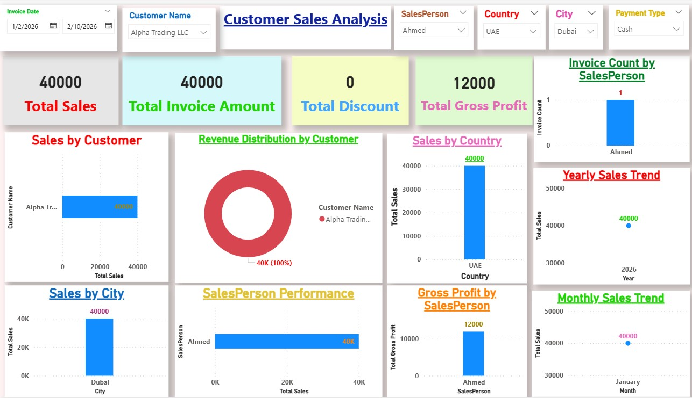
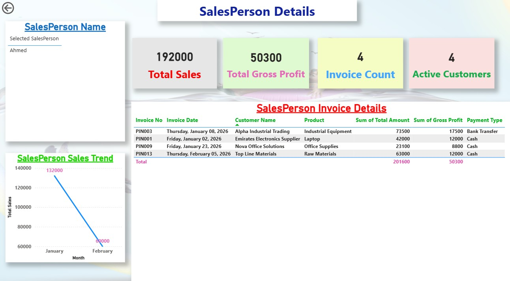
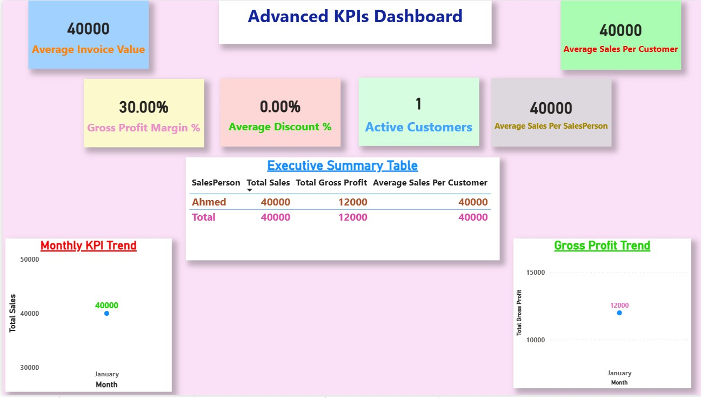

# 📊 Power BI Customer Sales Analytics Dashboard

## 📌 Project Overview

An interactive Power BI dashboard developed to analyze customer sales performance and provide data-driven insights.

The project focuses on transforming raw sales data into meaningful business intelligence through dynamic visualizations, KPI monitoring, customer analysis, and interactive reporting.

The dashboard helps management understand sales trends, customer profitability, salesperson performance, and key business indicators.

---

# 🎯 Project Objectives

- Analyze customer sales performance.
- Monitor revenue and profitability indicators.
- Identify top-performing customers and salespersons.
- Provide interactive analysis using Power BI features.
- Support better decision-making through data visualization.

# 📊 Dashboard Features

.

- Interactive customer sales performance analysis.
- Dynamic slicers for:
  - Invoice Date
  - Customer Name
  - Salesperson
  - Country
  - City
  - Payment Type

- Sales trend analysis.
- Customer performance evaluation.
- Interactive tooltips for additional insights.

.jpg)

- Detailed customer-level analysis.
- Drill-through functionality from customer analysis page.
- Customer KPIs:

  - Total Sales
  - Total Gross Profit
  - Invoice Count
  - Average Invoice Value

- Salesperson performance analysis.
- Sales contribution evaluation.
- Individual salesperson insights.

.

Key performance indicators:

- Total Sales
- Total Discount
- Total Invoice Amount
- Total Gross Profit

Provides a high-level overview of business performance.

## 📱 Mobile Responsive Layout

The dashboard was optimized for Power BI Mobile Layout to provide:

- Better mobile viewing experience.
- Improved KPI arrangement.
- Optimized visual placement.
- Easy navigation on mobile devices.

# 🛠 Tools & Technologies

- Power BI
- DAX Measures
- Power Query
- Microsoft Excel
- SQL
- Python
- AI Tools
- Data Analytics Concepts

# 📂 Project Files

Included:

- Power BI Dashboard File (.pbix)
- Dashboard Demo Video
- Dashboard Screenshots

# 📸 Dashboard Preview

### Customer-Sales-Analysis

.

### Customer-Details-(Drill-through-Analysis)

.jpg)

### Salesperson-Details

### Advanced-KPIs-Dashboard

.

# 🎬 Project Demo Video

Power BI Customer Sales Analytics Dashboard Demo

# 💡 Key Insights

- Analyzed customer sales contribution and profitability.
- Identified sales performance patterns.
- Improved reporting efficiency through interactive dashboards.
- Enabled management-level decision support.

# 👨‍💻 Author

**Mostafa Hisham**  

Senior Accountant | Data Analyst

Skills:
Power BI | DAX | Excel | SQL | Python | Data Analytics
